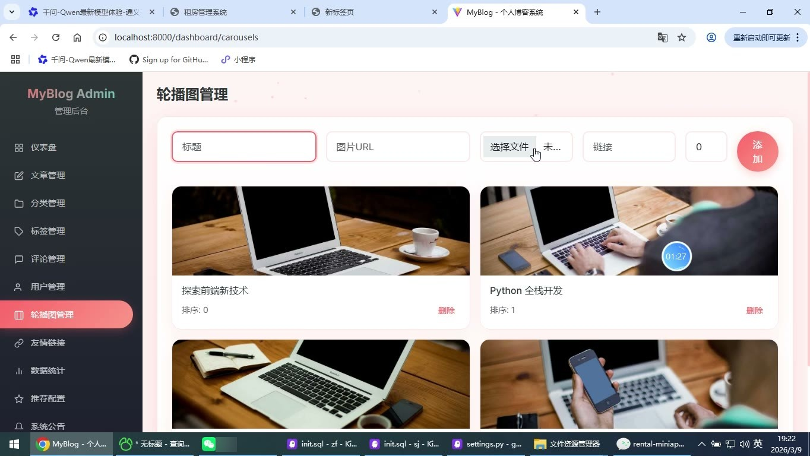
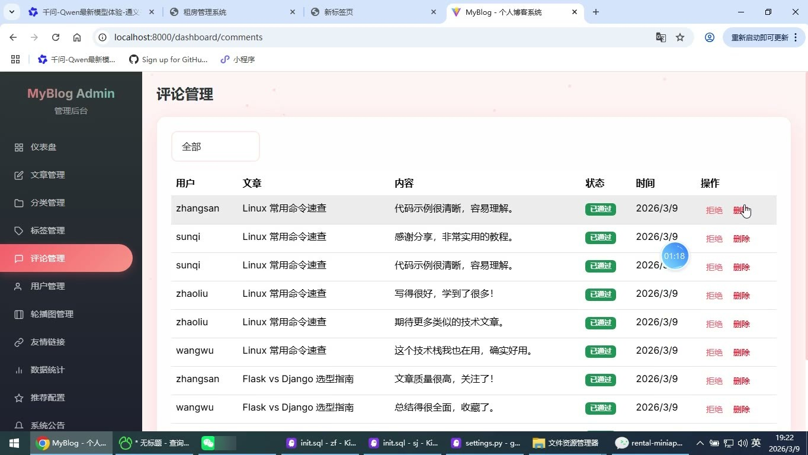
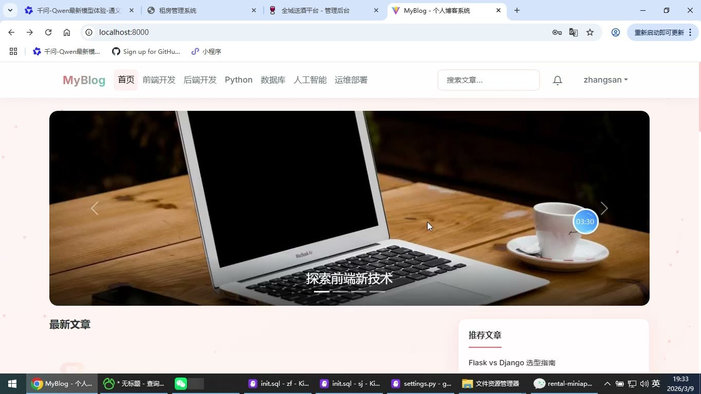
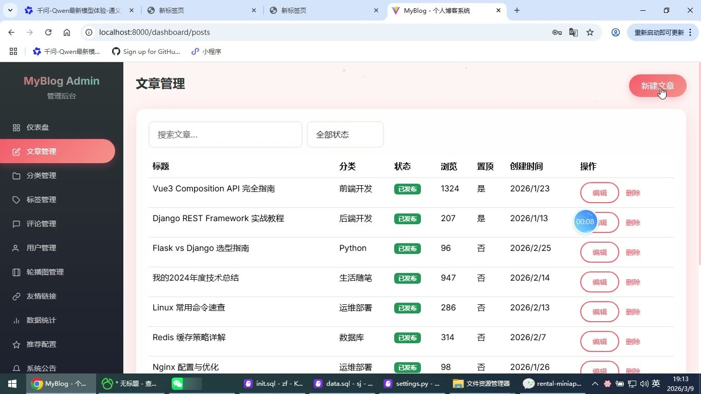
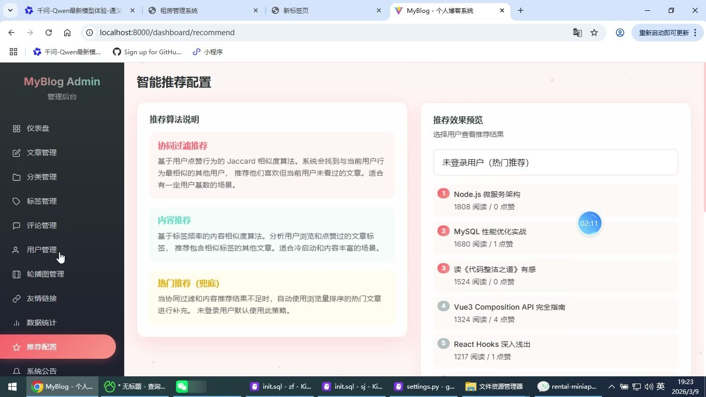

# (附文档)Python+Django+Vue3 个人博客系统

**技术栈**：Python、Django、Vue3、MySQL

### 系统简介

本系统是一套基于 Django + Vue3 的前后端分离个人博客平台，后端提供 REST 风格接口，前端采用 Vue3 单页应用架构，数据存储使用 MySQL。系统包含普通用户端与管理员端两类角色，覆盖文章浏览、互动、个人中心、内容管理与站点运营等完整业务链路。
 
### 核心功能
 
### 普通用户端

 
- 注册账号：填写用户名、邮箱、密码完成注册，校验用户名与邮箱唯一性。 
- 登录系统：支持使用用户名或邮箱加密码登录，登录后按角色跳转对应首页。 
- 重置密码：通过注册邮箱与新密码直接重置登录密码。 
- 浏览文章列表：按发布时间分页展示已发布文章，支持关键词、分类、标签筛选。 
- 查看文章详情：进入文章详情页自动累加浏览量，并记录到个人浏览历史。 
- 点赞与收藏：在文章详情页一键点赞或收藏，再次点击可取消。 
- 发表评论：对文章发表评论，支持回复指定评论形成层级结构，提交时进行敏感词校验。 
- 个人中心：查看我的点赞、我的收藏、我的评论、我的浏览历史列表。 
- 消息通知：查看系统公告、博文更新、评论通知，支持单条已读与全部已读。 
- 资料维护：查看并修改个人用户名、头像与个人简介。 
- 搜索与分类浏览：通过搜索页、分类页、标签页定位感兴趣的文章内容。
 
### 管理员端

 
- 仪表盘概览：展示文章总数、用户总数、评论总数、总浏览量四张统计卡片。 
- 数据可视化：以折线图展示文章发布趋势，以饼图展示分类文章分布。 
- 文章管理：分页查看文章列表，支持按标题关键词与发布状态筛选。 
- 文章编辑：新建或编辑文章，设置标题、摘要、Markdown 内容、封面图、分类、标签、状态与置顶。 
- 文章删除：对指定文章执行删除操作。 
- 分类管理：新增、编辑、删除分类，设置分类名称与排序值，查看各分类文章数。 
- 标签管理：新增、删除标签，展示每个标签关联的文章数量。 
- 评论管理：按待审核、已通过、已拒绝状态筛选评论，执行通过、拒绝、删除操作。 
- 用户管理：查看用户列表，展示用户名、邮箱、角色与注册时间。 
- 轮播图管理：新增与删除首页轮播图，配置标题、图片、跳转链接与排序。 
- 友情链接管理：新增与删除友情链接，配置名称、链接地址与 Logo。 
- 站点配置：维护站点名称、站点描述、站点关键词与页脚文字。 
- 敏感词管理：添加与移除敏感词，保存后用于评论内容过滤。 
- 公告推送：向所有用户发送系统公告，并查看已发送公告的接收人数与发送时间。 
- 智能推荐配置：查看协同过滤、内容推荐、热门兜底三种推荐策略说明，并按用户预览推荐结果。 
- 数据采集：输入关键词从技术社区采集文章，充实内容库。 
- 数据统计：查看热门文章 Top 10 的浏览与点赞对比、分类文章数饼图、浏览量趋势柱状图。
 
### 技术栈

 后端框架Python + Django 数据模型Django ORM（User、Post、Category、Tag、Comment、Like、Favorite、BrowseHistory、Notification、Carousel、FriendLink、SiteConfig） 权限控制基于角色的接口装饰器校验（admin / user） 前端框架Vue3（Composition API + script setup） 前端路由Vue Router（前台布局与后台布局分离） 状态管理Pinia（用户状态） 构建工具Vite 图表库ECharts 数据库MySQL
 
### 交付内容

 
- 后端完整源码 
- 前端完整源码 
- 数据库初始化脚本 
- 万字文档

## 界面展示

---

## 获取完整源码 + 万字文档

本仓库为项目介绍页。**完整前后端源码、数据库初始化脚本、万字项目文档**，请加微信 `kangkangcode`，或访问 [codekk.top](http://codekk.top) 获取。

可作课程设计 / 毕业设计参考，支持远程部署调试。